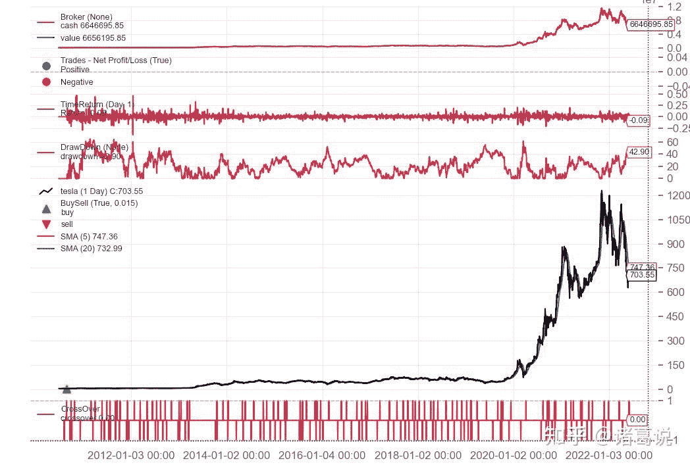

<!--yml
category: 交易
date: 2023-09-17 20:12:22
-->

# 量化框架backtrader之一文读懂可视化 - 知乎

> 来源：[https://zhuanlan.zhihu.com/p/539646940](https://zhuanlan.zhihu.com/p/539646940)



## **简介**

回测时往往想知道策略中间的运行情况，虽然可以通过最后的统计指标来一窥端倪，但对回测过程进行可视化是最符合人性的，同时通过观察回测过程也可以更好的设计&优化量化策略。Backtrader使用matplotlib库提供可视化能力

## **使用方法**

Backtrader数据可视化非常简单，只需在run()之后调用plot()方法即可。

```
cerebro.run()
cerebro.plot() 
```

`plot(self, plotter=None, numfigs=1, iplot=True, **kwargs)` 方法各参数含义如下：

*   `plotter`: 包含绘图属性的PlotScheme及其派生类对象。默认为None，如果为None，则默认的PlotScheme对象会被实例化
*   `numfigs` ：将图形拆分成多幅图展示，默认为1
*   `iplot` ： 在Jupyter Notebook运行则是否自动 plot inline，默认为True。如果不在jupyter中运行，该参数最好设置为False，否则容易出问题
*   `*kwargs`：args参数用于改变plotter属性值

可以通过两种办法来系统性控制可视化配置：

1.  直接通过设置plot()方法的args参数，如下所示。

```
cerebro.plot(iplot=False,
             style='candel',  # 设置主图行情数据的样式为蜡烛图
             plotdist=0.1,    # 设置图形之间的间距
             barup = '#ff9896', bardown='#98df8a', # 设置蜡烛图上涨和下跌的颜色
             volup='#ff9896', voldown='#98df8a', # 设置成交量在行情上涨和下跌情况下的颜色
            ) 
```

2\. 自定义 PlotScheme 类修改对应的参数

PlotScheme对象包括了所有的系统级绘图选项，选项如下所示。

```
class PlotScheme(object):
    def __init__(self):
        # to have a tight packing on the chart wether only the x axis or also
        # the y axis have (see matplotlib)
        self.ytight = False

        # y-margin (top/bottom) for the subcharts. This will not overrule the
        # option plotinfo.plotymargin
        self.yadjust = 0.0
        # Each new line is in z-order below the previous one. change it False
        # to have lines paint above the previous line
        self.zdown = True
        # Rotation of the date labes on the x axis
        self.tickrotation = 15

        # How many "subparts" takes a major chart (datas) in the overall chart
        # This is proportional to the total number of subcharts
        self.rowsmajor = 5

        # How many "subparts" takes a minor chart (indicators/observers) in the
        # overall chart. This is proportional to the total number of subcharts
        # Together with rowsmajor, this defines a proportion ratio betwen data
        # charts and indicators/observers charts
        self.rowsminor = 1

        # Distance in between subcharts
        self.plotdist = 0.0

        # Have a grid in the background of all charts
        self.grid = True

        # Default plotstyle for the OHLC bars which (line -> line on close)
        # Other options: 'bar' and 'candle'
        self.style = 'line'

        # Default color for the 'line on close' plot
        self.loc = 'black'
        # Default color for a bullish bar/candle (0.75 -> intensity of gray)
        self.barup = '0.75'
        # Default color for a bearish bar/candle
        self.bardown = 'red'
        # Level of transparency to apply to bars/cancles (NOT USED)
        self.bartrans = 1.0

        # Wether the candlesticks have to be filled or be transparent
        self.barupfill = True
        self.bardownfill = True

        # Wether the candlesticks have to be filled or be transparent
        self.fillalpha = 0.20

        # Wether to plot volume or not. Note: if the data in question has no
        # volume values, volume plotting will be skipped even if this is True
        self.volume = True

        # Wether to overlay the volume on the data or use a separate subchart
        self.voloverlay = True
        # Scaling of the volume to the data when plotting as overlay
        self.volscaling = 0.33
        # Pushing overlay volume up for better visibiliy. Experimentation
        # needed if the volume and data overlap too much
        self.volpushup = 0.00

        # Default colour for the volume of a bullish day
        self.volup = '#aaaaaa'  # 0.66 of gray
        # Default colour for the volume of a bearish day
        self.voldown = '#cc6073'  # (204, 96, 115)
        # Transparency to apply to the volume when overlaying
        self.voltrans = 0.50

        # Transparency for text labels (NOT USED CURRENTLY)
        self.subtxttrans = 0.66
        # Default font text size for labels on the chart
        self.subtxtsize = 9

        # Transparency for the legend (NOT USED CURRENTLY)
        self.legendtrans = 0.25
        # Wether indicators have a leged displaey in their charts
        self.legendind = True
        # Location of the legend for indicators (see matplotlib)
        self.legendindloc = 'upper left'

        # Plot the last value of a line after the Object name
        self.linevalues = True

        # Plot a tag at the end of each line with the last value
        self.valuetags = True

        # Default color for horizontal lines (see plotinfo.plothlines)
        self.hlinescolor = '0.66'  # shade of gray
        # Default style for horizontal lines
        self.hlinesstyle = '--'
        # Default width for horizontal lines
        self.hlineswidth = 1.0

        # Default color scheme: Tableau 10
        self.lcolors = tableau10

        # strftime Format string for the display of ticks on the x axis
        self.fmt_x_ticks = None

        # strftime Format string for the display of data points values
        self.fmt_x_data = None 
```

PlotScheme类定义了一个`color(self, idx)` 方法返回将要使用的颜色，子类可以重载，其idx参数为要绘制的line的当前index。 如MACD 绘制3条线，idx变量有0，1和2共3个值，新的指标idx会从0重新开始。默认的color scheme是`Tableau 10 Color Palette` ，对应的index是`tab10_index = [3, 0, 2, 1, 2, 4, 5, 6, 7, 8, 9]` 。可以通过在自定义 PlotScheme类重载color()方法或传递 lcolors 变量给plot 方法来改变要使用的颜色。

```
def color(self, idx):
        colidx = tab10_index[idx % len(tab10_index)]
        return self.lcolors[colidx] 
```

## **可视化组件**

Backtrader支持3大部分组件的可视化：

*   Data feeds数据源：通过 adddata、replaydata和resampledata方法导入cerebro的原始数据
*   *Indicators*指标：在策略类中声明或者通过 addindicator 添加的指标
*   Observers观测器对象：通过addobserver添加的观测器，如Cash和Value对象

在绘制图形时，默认是将data feeds数据源绘制在主图上，Indicators指标有的与 Data Feeds数据源一起绘制在主图上，比如均线，有的则以子图形式绘制；observers 通常绘制在子图上

## **可视化选项**

除了上面说的通过plot()参数和自定义PlotScheme来系统控制可视化选项外，*Indicators指标和Observers观测器有一些选项可以控制其绘图形式，一共有3种类型*:

*   **Object**对象级的可视化选项 —可以影响整个对象的绘制行为，由plotinfo来控制

```
plotinfo = dict(plot=True, # 是否绘制
                subplot=True, # 是否绘制成子图
                plotname='', # 图形名称
                plotabove=False, # 子图是否绘制在主图的上方
                plotlinelabels=False, # 主图上曲线的名称
                plotlinevalues=True,
                plotvaluetags=True,
                plotymargin=0.0,
                plotyhlines=[],
                plotyticks=[],
                plothlines=[],
                plotforce=False,
                plotmaster=None,
                plotylimited=True,
           ) 
```

有2种方法来访问plotinfo的属性，如下所示：

```
# 通过参数来设置
sma = bt.indicators.SimpleMovingAverage(self.data, period=15, plotname='mysma')

# 通过属性来设置
sma = bt.indicators.SimpleMovingAverage(self.data, period=15)
sma.plotinfo.plotname = 'mysma' 
```

*   Line线相关的可视化选项 — 可以使用plotlines对象来控制lines对象的绘图行为，plotlines中的选项会在绘图时直接传给matplotlib，如下所示。

```
lines = ('histo',)
plotlines = dict(histo=dict(_method='bar', alpha=0.50, width=1.0)) 
```

*   方法控制的可视化 — 当处理indicator指标和observer观测器时，_plotlabel(self), _plotinit(self)方法可以进一步控制可视化

## **结论 & 交流**

关注微信公众号：诸葛说talk，获取更多内容。同时还能获取邀请加入量化投资微信群， 与众多投资爱好者、量化从业者、技术大牛一起交流、切磋，在实战中快速提升自己的投资水平。

写文章不易，觉得本文对你有帮助的话，帮忙点个在看吧。

## **参考**