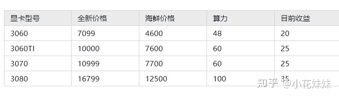
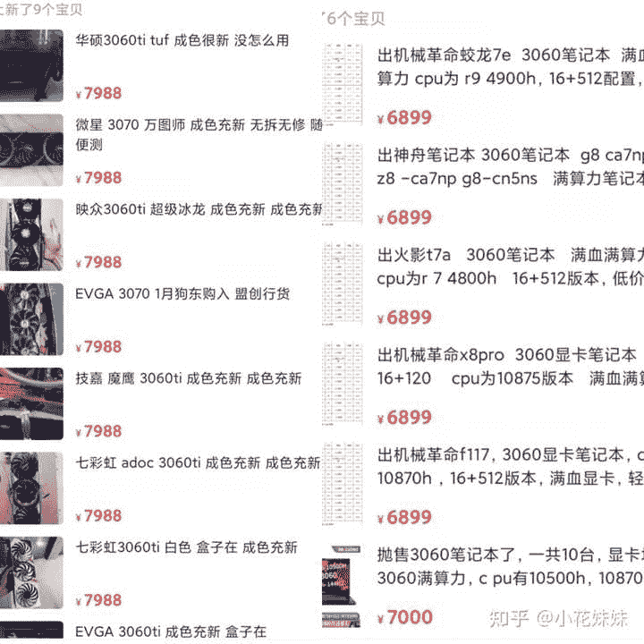

<!--yml
category: 挖矿
date: 2022-06-26 00:00:00
-->

# 金融委已点名比特币，要求各地关停比特币挖矿项目，显卡价格半年内是否有望恢复正常？

> 原文：[https://www.zhihu.com/question/461022447/answer/1904899673](https://www.zhihu.com/question/461022447/answer/1904899673)

 ## 海鲜市场最近动荡很大，3060显卡已经跌破5000元，3070跌破8000元。

我们肯定不能看摆的价格，讲讲价的成交价肯定是低于这个价格的。目前来说显卡价格仍旧偏高，虽然币价有回温。

下图仅代表个人对海鲜研究，仅供参考，不具有代表性意义。

3060TI和3070已经跌破8000元大关，目前少量个体户老板已经开始甩货。3060的笔记本也已经跌到7000以下，包括满血版。需要注意的是**满算力不等于满血，请仔细甄别。**

例如3060满血版的130W蛟龙7，显卡性能方面可以堪比3070残血版。8999的价格基本上属于满血版笔记本的性价比之星。

而神州的3060笔记本，基本上可以维持到7000出头的价格，同样是算力可以达到49M，其中的奥妙大家懂的都懂。

华硕的ROG魔霸新锐比较有代表性。笔记本原价9000需要抢购，抢到以后正常海鲜价格为加价1000-1500元。目前海鲜价格已经跌破8000元。

但是目前的币价正在回温，可能是收割做空的韭菜。锁算力版本如果放出以后，可能会再次迎来下跌。但是原价卡估计还需要时日，毕竟产能不足是关键性原因。

3090买3090敬请期待。

你的显卡现在值多少钱，请在评论区说出你的故事。

**挖矿专场**丨[挖矿教程](https://zhuanlan.zhihu.com/p/399409039)丨[笔记本挖矿](https://zhuanlan.zhihu.com/p/360451565)丨[锁算显卡怎么挑](https://zhuanlan.zhihu.com/p/374342633)丨[挖矿毁显卡吗](https://zhuanlan.zhihu.com/p/358944242)丨[矿卡也质保](https://zhuanlan.zhihu.com/p/386391253)丨

**猴山专场**丨[猴山解密3080TI](https://zhuanlan.zhihu.com/p/379179943)丨[猴山解密3070TI](https://zhuanlan.zhihu.com/p/379428935)丨[买70TI还是80TI](https://zhuanlan.zhihu.com/p/379846007)丨[猴山冲4K](https://zhuanlan.zhihu.com/p/380129626)丨

**笔记本专场**丨[满血版笔记本怎么挑](https://zhuanlan.zhihu.com/p/374748213)丨[买3060还是70本](https://www.zhihu.com/question/447817962/answer/1909204347)丨[3050本评价](https://www.zhihu.com/question/462045112/answer/1913547325)丨[蛟龙7测评](https://zhuanlan.zhihu.com/p/369226521)丨