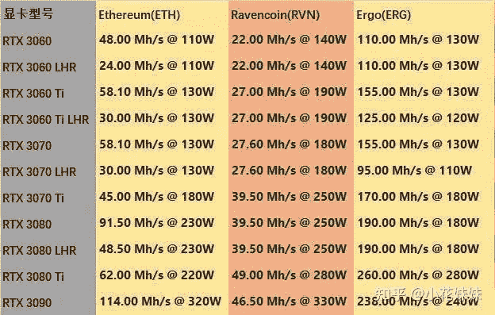
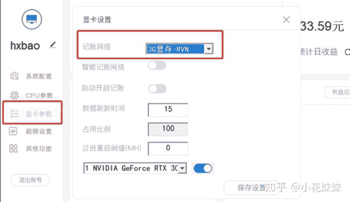
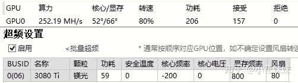
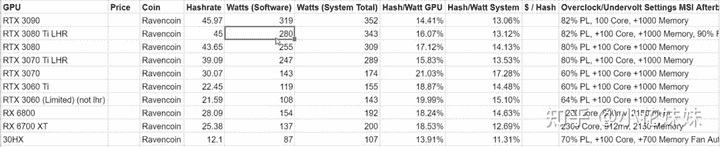
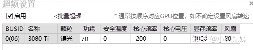

<!--yml
category: 挖矿
date: 2022-06-26 00:00:00
-->

# 锁算力显卡挖RVN（渡鸦）和ERGO（二狗）超频教程

> 原文：[https://zhuanlan.zhihu.com/p/402971584](https://zhuanlan.zhihu.com/p/402971584)

## 币种选择

根据你手中的卡是否锁算力来决定，未锁算力显卡还是以ETH为主。而锁算力显卡因为锁了ETH的算力，只能选择弯道超车，挖其他算法的小币种。

> **未锁算力显卡**和**笔记本**，最佳的选择仍旧是ETH

ETH教程：

**3080挖ETH举例：**

### 锁算力显卡，目前有两个选择RVN和ERGO。

下图为3080TI的预计盈利：RVN：52算力，ERGO：260算力。已经填入了显卡功耗的电费。

其他显卡的算力可以参考这里，个人实际体验下来算力和功耗略有偏差。但是没有实质性的影响。

### 供电导致的区别：

使用了3080TI的战斧和ADOC进行对比测试，战斧是2个8pin供电口，挖RVN最高功耗310W左右撞功耗墙。最高算力达到52Mh/s左右。

而3080TI的七彩虹ADOC拥有3个8pin供电口，在RVN算力下可以达到350W功耗。算力可以在显存+1200左右的情况下达到58Mh/s算力，差价也提现出了算力的差距。

### 两个币的优缺点

**RVN**：需要满功耗来提供高算力，比较吃显卡和电费。因为功耗高可能引起温度比较难以压制，相对于3070TI这种对于显存温度优化不好的显卡，可能显存温度达到110度。但是币有优点，各大交易所里面都有RVN这个币，相对比较稳定。甚至可以考虑屯币等上涨。

挖的方式也比较简单，可以直接用[教程](https://zhuanlan.zhihu.com/p/355955385)中的软件把**5G-ETH**改成**3G-RVN**就可以了。

**ERGO**：因为算法的原因，锁算力的触发对于ERGO也是有效果的。所以超频的时候需要压功耗。温度非常感人安全。传言DDR6X显存非常能超，一般干到1500-1700都没有问题，我这是比较保守的超频参数。

ERGO对于矿池和交易所的支持非常不友好。个人使用的是独角兽矿池搭配芝麻开门的交易所。其他的几大交易所都无法搜到ERGO这个币。所以价值和稳定性就略有欠缺。可以考虑够额度就卖。

## 超频方式

**RVN超频**的方式比较简单，功耗直接100%撞功耗墙就可以了，核心可以不用动，直接微调显存就可以了。大胆的干1600，保守的干1000就可以了。

下图的超频**算力**和**功耗**都不满，只能说是相对参考。

> 如果温度太高，就只能压功耗降算力。

**ERGO超频**方式因为是有锁算力的触发机制，必须要调整压低功耗来避免触发锁算力。超频的方式是先确定自己能接受的核心和显存，然后调低功耗。核心可以选择-200或者-400，显存频率选择1000-1600之间的数字直接填入就可以了，风扇50-80都可以，然后开始调整功耗。

初期填写如下：

然后开始调整降低功耗，直到算力**成倍上升**并且**稳定**为止就可以了。

个人的ADOC功耗压到60可以稳定算力，但是为了保险压到了59的功耗。如果调整70以上算力会降低到130Mh/s左右。其他的显卡调整方式雷同，**功耗是稳定算力的关键**。

**挖矿专场**丨[挖矿教程](https://zhuanlan.zhihu.com/p/355955385)丨[笔记本挖矿](https://zhuanlan.zhihu.com/p/360451565)丨[锁算显卡怎么挑](https://zhuanlan.zhihu.com/p/374342633)丨[挖矿毁显卡吗](https://zhuanlan.zhihu.com/p/358944242)丨[矿卡也质保](https://zhuanlan.zhihu.com/p/386391253)丨

**猴山专场**丨[猴山解密3080TI](https://zhuanlan.zhihu.com/p/379179943)丨[猴山解密3070TI](https://zhuanlan.zhihu.com/p/379428935)丨[买70TI还是80TI](https://zhuanlan.zhihu.com/p/379846007)丨[猴山冲4K](https://zhuanlan.zhihu.com/p/380129626)丨

**笔记本专场**丨[满血版笔记本怎么挑](https://zhuanlan.zhihu.com/p/374748213)丨[买3060还是70本](https://www.zhihu.com/question/447817962/answer/1909204347)丨[3050本评价](https://www.zhihu.com/question/462045112/answer/1913547325)丨[蛟龙7测评](https://zhuanlan.zhihu.com/p/369226521)丨