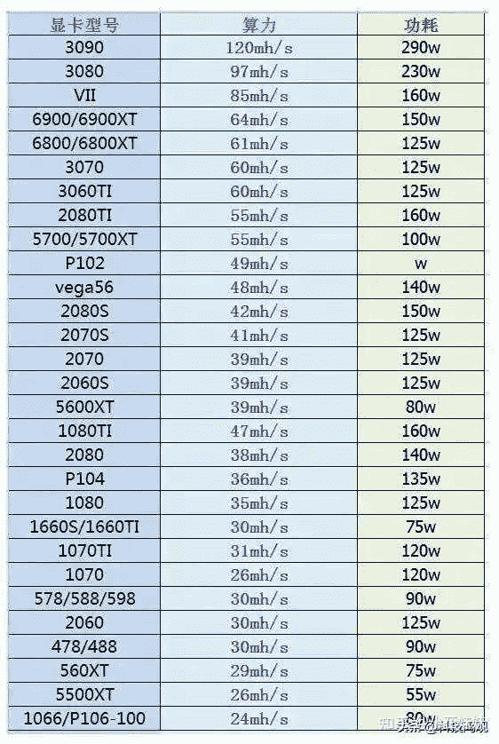

<!--yml
category: 挖矿
date: 2022-06-26 00:00:00
-->

# 锁算力的显卡能挖矿吗？

> 原文：[https://www.zhihu.com/question/470345735/answer/2054898687](https://www.zhihu.com/question/470345735/answer/2054898687)

 ### 能挖，而且只有挖以太坊的时候是一半算力，挖其他币种是满算力。

锁算力显卡的缩写是LHR，也就是低哈希值运算的缩写。这种锁算力基本上只针对ETH的算法，导致在挖ETH的时候只有一半的算力。

正常来说一张3060应该有48-50左右的算力，而锁算力显卡只有23左右的算力。也就是英伟达并没有完全锁定哈希值，只锁了一半。

### 下图算力减半，就是锁算力显卡的ETH算力。

而所谓的挖矿，是挖虚拟货币大家也都知道。但是虚拟货币有很多算法，比如比特币吃的是GPU，以太坊吃的是显存。所以锁算力显卡基本上只针对挖以太坊的时候只有一半的算力。

最近为了让锁算力显卡也发光发热，丧心病狂的矿工们又开始捧红新的币种，可以让锁算力显卡也可以满算力的运算。

### 目前已知RVN算力总结

正常来说，未锁算力显卡的回本周期都维持在200-250天左右。所以算力减去一半导致回本周期长了一倍才有了提问者搜到的“**不划算**”一说。毕竟矿工是为了赚钱，不是为了玩游戏，但是对于等等党来说却是天大的喜讯。

目前未锁算力显卡二手的价格都远远高于锁算力显卡全新的价格。

**等等党？永不为奴！**

**挖 矿 专 场**丨[挖矿教程](https://zhuanlan.zhihu.com/p/355955385)丨 [笔本挖矿](https://zhuanlan.zhihu.com/p/360451565)丨[挖矿毁显卡吗](https://zhuanlan.zhihu.com/p/358944242)丨[矿卡也质保](https://zhuanlan.zhihu.com/p/386391253)丨

**锁 算 专 场**丨[锁算卡挖矿](https://zhuanlan.zhihu.com/p/398651881)丨[RVN和ERGO教程](https://zhuanlan.zhihu.com/p/402971584)丨[锁算卡挑选](https://zhuanlan.zhihu.com/p/374342633)丨[挖矿知识点合集](https://www.zhihu.com/question/461044682/answer/1994951468)

**笔记本专场**丨[满血版笔记本怎么挑](https://zhuanlan.zhihu.com/p/374748213)丨[买3060还是70本](https://www.zhihu.com/question/447817962/answer/1909204347)丨[蛟龙7测评](https://zhuanlan.zhihu.com/p/369226521)丨